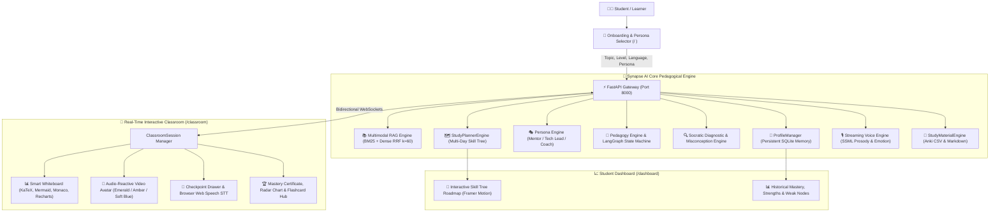

# 🎓 Synapse AI Teacher — Autonomous Multimodal Socratic Video Educator

[](https://github.com/madhavzanwar/synapse-ai-teacher)
[](https://nextjs.org/)
[](https://fastapi.tiangolo.com/)
[](https://deepmind.google/technologies/gemini/)
[](LICENSE)

> **Built for the AI Innovation Hackathon 2026**  
> **Developed by Madhav Zanwar (`madhav_builds`)** — *AIML Student | Problem Solver | Tech Enthusiast*

---

## 🌟 Mission Overview

Traditional AI learning tools operate as passive question-answering chatbots. **Synapse AI Teacher** is an **autonomous, human-like AI educator** that delivers an interactive video classroom experience. 

It grounds lessons in uploaded lecture notes, constructs adaptive Socratic lesson plans, delivers lectures via an audio-reactive AI video avatar and natural voice, visualizes concepts on an interactive smart whiteboard (LaTeX math, Mermaid diagrams, Monaco code execution, Recharts graphs), detects student cognitive misconceptions, provides real-time empathetic intervention upon frustration, remembers learner knowledge gaps across sessions, and generates structured multi-day skill tree roadmaps with exportable Anki flashcards.

---

## 🏗️ System Architecture



---

## ✨ Key Features & Capabilities

### 1. 📚 Multimodal RAG Document Grounding
- Ingests **PDFs, DOCX, PPTX, Markdown, and text notes**.
- Multi-column extraction preserving mathematical formulations into LaTeX expressions.
- **Hybrid Retrieval Strategy**: Reciprocal Rank Fusion ($k=60$) combining Sparse lexical Okapi BM25 with Dense semantic vector embeddings.

### 2. 🎭 Three Distinct Teacher Personas
- **Dr. Sophia (The Socratic Mentor)**: Warm, patient, uses intuitive real-world analogies, and guides students through guided questioning.
- **Alex Chen (The Senior Tech Lead)**: Direct, razor-sharp, focuses on first-principles derivations, asymptotic complexity ($O(N^2)$), GPU memory tradeoffs, and production architectures.
- **Coach Marcus (The Fast-Paced Coach)**: High-energy, rapid-fire drills, bottom-line takeaways, and high-yield exam insights.

### 3. 🔍 Socratic Diagnostic & Dynamic Remediation Loop
- Analyzes student answers (both MCQs and open-ended conceptual explanations).
- Categorizes errors into minor terminology slips vs deep cognitive misconceptions.
- Dynamically pivots pedagogical strategy:
  1. *Simpler Real-World Physical Analogy*
  2. *First-Principles Foundational Derivation*
  3. *Visual Counterexample / Edge-Case Code*
  4. *2-Step Sequential Breakdown*

### 4. 🌿 Emotion-Aware Frustration Detection & Calming Intervention
- Linguistic analysis detects frustration and cognitive overload (e.g. *"I don't understand"*, *"too hard"*, *"confused"*, *"kuch samajh nahi aa raha"*).
- Triggers `EMOTIONAL_INTERVENTION`:
  - Avatar dock illuminates in **Calming Soft Blue** (`#38bdf8`).
  - Delivers empathetic reassurance with `<emotion=empathetic>` prosody (slower rate `0.88x`, gentle pitch).
  - Temporarily downgrades complexity to re-anchor core intuition.

### 5. 💾 Persistent Learner Memory (SQLite Database)
- Tracks student performance, overall mastery %, and weak nodes across sessions (`synapse_learning.db`).
- **Cognitive Scaffolding Injection**: When planning new lessons, past knowledge gaps are proactively passed to the curriculum planner to allocate more time and simpler analogies.

### 6. 📑 Automated Study Guides & Anki Flashcard Exporter
- **Targeted Smart Flashcards**: Weighted heavily toward the student's identified misconception nodes.
- **Direct Anki/Quizlet CSV**: Semicolon-delimited format with HTML formatting and tagging ready for instant import.
- **Structured Markdown Guides**: Complete with LaTeX equations, teacher analogies, and self-test checkpoints.

### 7. 🌳 AI Multi-Day Study Planner & Skill Tree Roadmap
- Decomposes broad topics into 3-day, 7-day, or 14-day sequential milestone roadmaps.
- Interactive vertical skill tree with unlock mechanics, prerequisite connectors, and one-click lesson launches.
- Curated tracks for **GreenTech & Climate Action** and **AI & Transformer Architecture**.

### 8. 🌐 Multilingual Teaching
- Real-time fluency across **English**, **Hinglish (Natural conversational blend)**, **Hindi (हिंदी)**, and **Spanish (Español)**.

---

## 🛠️ Tech Stack

- **Frontend**: Next.js 15 (App Router), TypeScript, Tailwind CSS v4, Framer Motion, Lucide React, Canvas Confetti.
- **Smart Whiteboard Visualizers**:
  - **KaTeX / React-Latex-Next**: Mathematical equations & formulas.
  - **Mermaid.js**: Dynamic flowcharts, biology cycles, system state diagrams.
  - **Monaco Editor (`@monaco-editor/react`)**: Interactive syntax-highlighted code execution.
  - **Recharts**: Cognitive Knowledge Radar charts & data graphs.
- **Backend & AI Orchestration**:
  - **FastAPI**: REST API, WebSockets, Server-Sent Events (SSE).
  - **LangGraph & LangChain**: Socratic pedagogical state machine.
  - **Google Gemini 1.5**: LLM for curriculum planning, diagnosis, and study paths.
  - **SQLite**: Multi-session persistent learner memory.
  - **PyPDF & TikToken**: Document chunking and embedding tokenization.

---

## 🚀 Getting Started

### Prerequisites
- Node.js 18+ & npm
- Python 3.10+
- Google Gemini API Key ([Get one here](https://aistudio.google.com/))

### 1. Clone the Repository
```bash
git clone https://github.com/madhavzanwar/synapse-ai-teacher.git
cd synapse-ai-teacher
```

### 2. Backend Setup
```bash
cd backend
python -m venv venv

# On Windows:
.\venv\Scripts\activate
# On Linux/macOS:
source venv/bin/activate

pip install -r requirements.txt

# Configure your Gemini API Key:
cp .env.example .env
# Edit backend/.env and set: GEMINI_API_KEY=your_actual_key_here
```

### 3. Frontend Setup
```bash
cd ../frontend
npm install

# (Optional) Create local env:
cp .env.example .env.local
```

### 4. Run the Full Stack

#### One-Click Launchers:
- **Windows Batch**: Double-click or run `start_synapse.bat`
- **Windows PowerShell**: `.\start_synapse.ps1`
- **Linux / macOS Bash**: `./start_synapse.sh`

#### Or Manual Two-Terminal Launch:
```bash
# Terminal 1 (Backend):
cd backend
uvicorn app.main:app --host 0.0.0.0 --port 8000 --reload

# Terminal 2 (Frontend):
cd frontend
npm run dev
```

Open [http://localhost:3000](http://localhost:3000) in your browser!

---

## 🧪 Automated Verification Suite

Run the 9-stage end-to-end automated system verification script:

```bash
cd backend
python verify_e2e.py
```

### Verification Output:
```
===========================================================================
      SYNAPSE AI TEACHER — FULL END-TO-END VERIFICATION SUITE
===========================================================================
[STAGE 1/9] Ingesting Document for Authoritative Hybrid Grounding... [SUCCESS]
[STAGE 2/9] Synthesizing Adaptive Curriculum with Persona & Memory... [SUCCESS]
[STAGE 3/9] Simulating Socratic Checkpoint (Correct Mastered Answer)... [SUCCESS]
[STAGE 4/9] Simulating Misconception & Dynamic Remediation Loop... [SUCCESS]
[STAGE 5/9] Simulating Student Frustration & Emotional Intervention... [SUCCESS]
[STAGE 6/9] Concluding Lesson & Generating Post-Lesson Mastery Certificate... [SUCCESS]
[STAGE 7/9] Exporting Study Materials & Anki Flashcard CSV... [SUCCESS]
[STAGE 8/9] Generating AI Multi-Day Learning Path & Skill Tree... [SUCCESS]
[STAGE 9/9] Verifying Persistent Learner Memory in SQLite... [SUCCESS]
===========================================================================
   ALL 9 END-TO-END SUBSYSTEMS VERIFIED WITH 100% INTEGRITY! [SUCCESS]
===========================================================================
```

---

## 👨‍💻 Developer & Team Attribution

- **Lead Systems Architect & Full-Stack AI Engineer**: **Madhav Zanwar (`madhav_builds`)**
- **Role**: AIML Student | Problem Solver | Tech Enthusiast
- **Project**: Synapse AI Teacher — AI Innovation Hackathon 2026

---

## 📄 License
This project is open source and available under the [MIT License](LICENSE).
