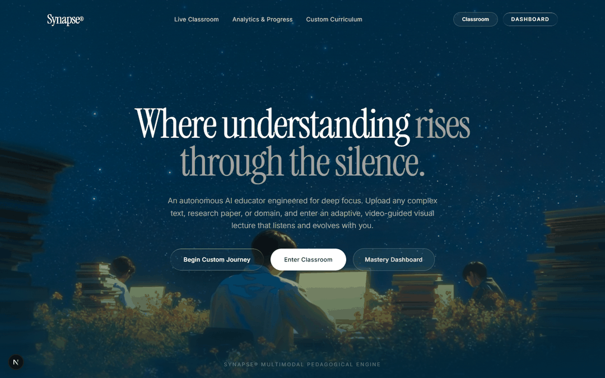
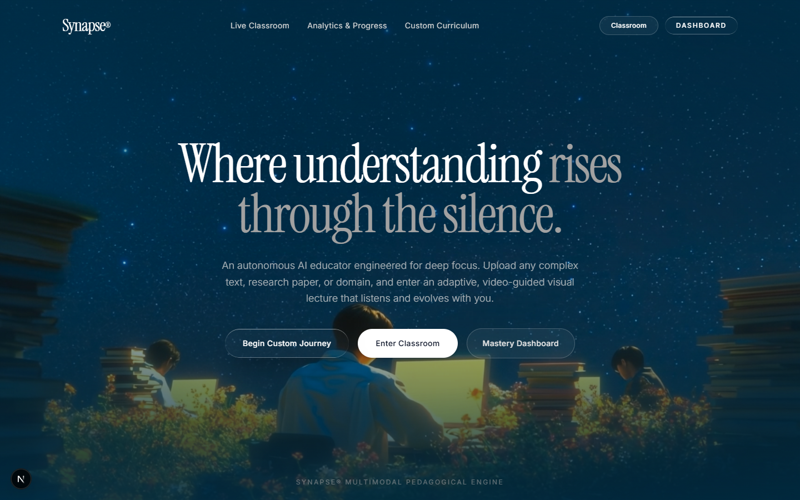
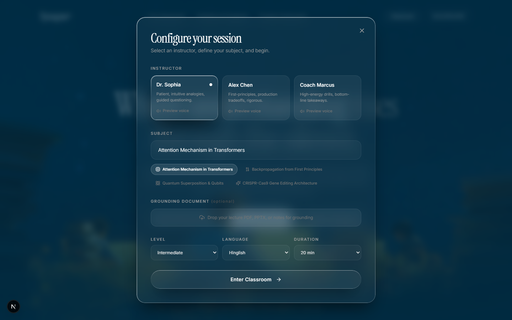
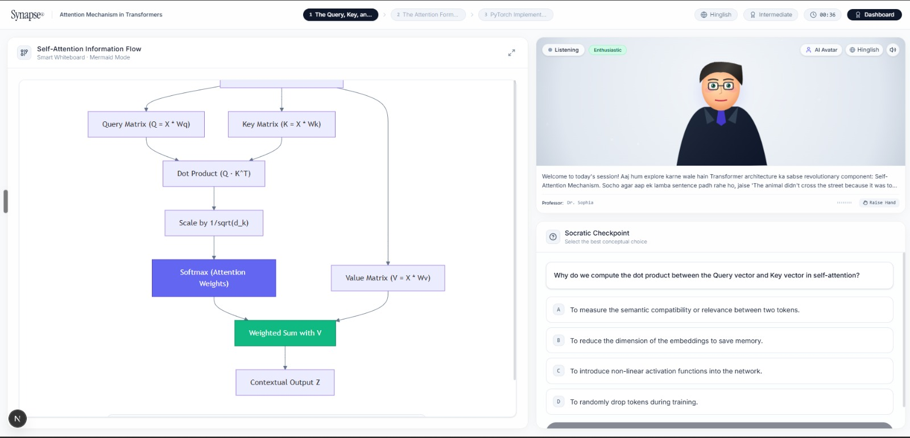
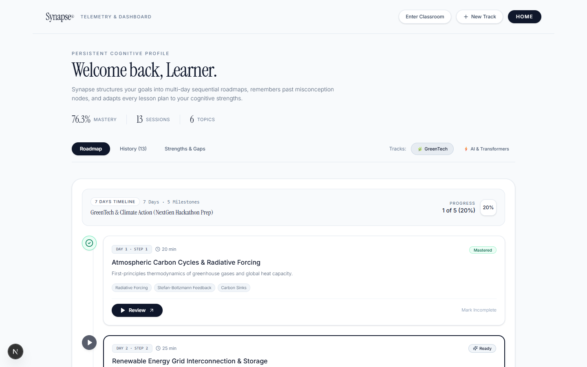
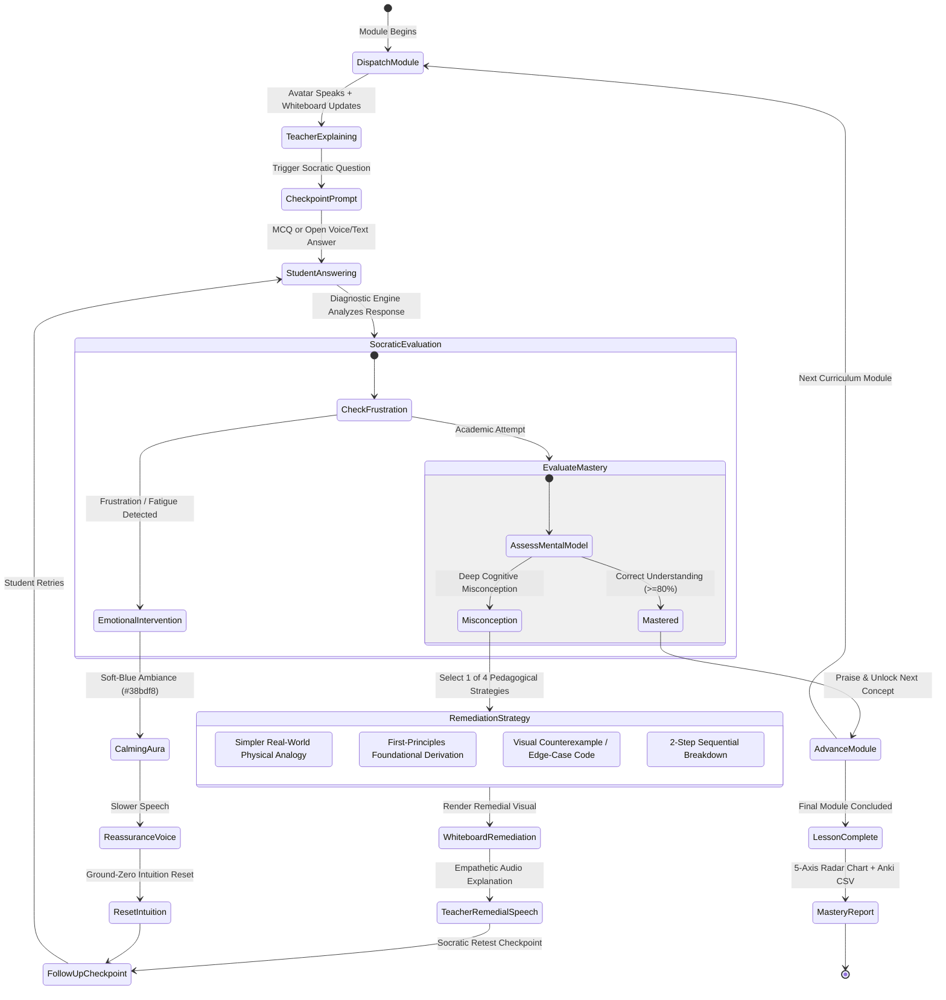
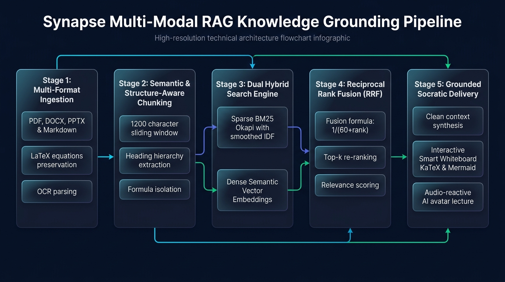

# 🎓 Synapse AI Teacher — Autonomous Multimodal Socratic Video Educator

[](https://github.com/madhavzanwar/synapse-ai-teacher)
[](https://nextjs.org/)
[](https://fastapi.tiangolo.com/)
[](https://deepmind.google/technologies/gemini/)
[](https://simli.ai/)
[](https://elevenlabs.io/)
[](LICENSE)

> **Built for the AI Innovation Hackathon 2026**  
> **Developed by Madhav Zanwar (`madhav_builds`)** — *AIML Student | Problem Solver | Tech Enthusiast*

---

## 📽️ Live Hero Section Showcase



*Figure 1: Real-time dynamic liquid-glass hero onboarding with ambient glowing orb physics, multi-persona selection, and seamless lecture launches.*

---

## 🌟 Mission & Problem Statement

### The Problem
Traditional AI education tools (chatbots, static flashcard generators, text summarizers) are **passive**:
- They wait for students to ask questions, putting the cognitive burden of curriculum progression on the learner.
- They cannot see or hear when a student is frustrated or overloaded.
- They lack visual pedagogical instruments (equations, live code execution, reactive flowcharts).
- When a student answers incorrectly, typical chatbots merely provide the answer rather than dissecting the **underlying mental misconception** through Socratic dialogue.

### The Synapse Paradigm Shift
**Synapse AI Teacher** is an **autonomous, human-like AI educator** that delivers a live, real-time video classroom experience:
- **Grounds lessons** in uploaded lecture notes, textbooks, and multi-column PDFs.
- **Synthesizes adaptive Socratic curricula** tailored to student proficiency, time budgets, and language.
- **Delivers lectures via an audio-reactive AI video avatar** (Simli WebRTC with procedural canvas fallback) and natural emotional voice (ElevenLabs SSML).
- **Visualizes concepts on an interactive smart whiteboard** combining LaTeX mathematics (KaTeX), dynamic architecture diagrams (Mermaid), real-time syntax-highlighted code execution (Monaco), and loss/accuracy curves (Recharts).
- **Diagnoses misconceptions & executes dynamic pedagogical remediation loops** using 4 distinct strategies.
- **Detects student frustration & triggers calming interventions** with soft-blue visual ambiance and empathetic prosody.
- **Maintains persistent multi-session memory** in SQLite to reinforce weak knowledge nodes over time.
- **Decomposes broad topics into multi-day skill tree roadmaps** with exportable Anki flashcard CSVs.

| Capability | Standard AI Chatbots | Synapse AI Teacher |
| :--- | :---: | :---: |
| **Autonomous Lecture Delivery** | ❌ Passive text answers only | ✅ Autonomous video avatar + natural voice |
| **Real-Time Whiteboard Visuals** | ❌ Plain markdown text | ✅ KaTeX equations, Mermaid graphs, Monaco code, Recharts |
| **Socratic Misconception Diagnosis** | ❌ Gives away answers | ✅ Distinguishes slips from root misconceptions |
| **Dynamic Pedagogical Remediation** | ❌ Repetitive text restatements | ✅ 4 adaptive corrective strategies |
| **Frustration & Emotional Care** | ❌ Tone-deaf | ✅ Empathetic voice prosody & calming UI shift |
| **Document Grounding (RAG)** | ⚠️ Basic text chunking | ✅ Hybrid BM25 + Dense RRF ($k=60$) preserving LaTeX |
| **Persistent Learner Memory** | ❌ Amnesiac across sessions | ✅ Multi-session SQLite memory & radar chart |
| **Spaced Repetition & Roadmap** | ❌ None | ✅ Anki/Quizlet CSV exporter & multi-day skill tree |

---

## 📸 Platform Gallery & Live Interface

| Screen | Description |
| :---: | :--- |
|  | **Ambient Fluid Onboarding (`/`)**: Liquid glass aesthetic with ambient floating physics, instant topic triggers, and live navigation. |
|  | **Adaptive Curriculum Configurator**: Multi-column PDF/notes upload, 3 teacher personas, 4 languages, and custom time budgets. |
|  | **Interactive Classroom (`/classroom`)**: Real-time smart whiteboard, video avatar feed, and Socratic checkpoint drawer. |
|  | **Mastery Dashboard (`/dashboard`)**: Persistent multi-day skill tree roadmap, radar charts, weak node tracking, and Anki exports. |

---

## 🏗️ System Architecture

### 1. Full-Stack Data & Stream Architecture


### 2. Socratic Diagnostic & Dynamic Remediation State Machine


---

## ✨ Key Capabilities & Deep Dives

### 1. 📚 Multimodal RAG Document Grounding



- Ingests **PDFs, DOCX, PPTX, Markdown, and text notes**.
- Multi-column layout parser preserves mathematical formulations and converts raw notation into standard LaTeX expressions.
- **Hybrid Search Strategy**: Reciprocal Rank Fusion ($k=60$) combining:
  1. Lexical sparse keyword ranking via [`PureBM25Okapi`](backend/app/services/rag_engine.py).
  2. Semantic dense cosine vector scoring with LaTeX symbol boost.
- Strict context citation ensuring zero hallucinations.

### 2. 🎭 Three Distinct Teacher Personas
- **Dr. Sophia (The Socratic Mentor)**: Warm, patient, uses intuitive everyday analogies, and scaffolds complex theories with guided questioning.
- **Alex Chen (The Senior Tech Lead)**: Direct, razor-sharp, focuses on first-principles derivations, asymptotic complexity ($O(N^2)$), GPU memory bottlenecks, and production architectures.
- **Coach Marcus (The Fast-Paced Coach)**: High-energy, rapid-fire drills, bottom-line takeaways, and high-yield exam insights.

### 3. 🔍 Socratic Diagnostic & Dynamic Remediation Loop
- Evaluates student responses across both MCQs and open-ended conceptual explanations (via text or voice microphone).
- Differentiates between **minor terminology slips** and **deep cognitive misconceptions**.
- Dynamically pivots pedagogical strategy:
  1. *Simpler Real-World Physical Analogy*
  2. *First-Principles Foundational Derivation*
  3. *Visual Counterexample / Edge-Case Code*
  4. *2-Step Sequential Breakdown*
- Generates targeted follow-up checkpoints to verify mastery before advancing.

### 4. 🌿 Emotion-Aware Frustration Detection & Calming Intervention
- Linguistic analysis detects frustration, confusion, and cognitive overload (e.g., *"I don't understand"*, *"too hard"*, *"confused"*, *"kuch samajh nahi aa raha"*).
- Triggers an immediate `EMOTIONAL_INTERVENTION`:
  - Avatar dock illuminates in a **Calming Soft Blue** (`#38bdf8`) glow.
  - Teacher adopts `<emotion=empathetic>` prosody (slower rate `0.88x`, gentle soothing pitch).
  - Temporarily downgrades complexity to re-anchor core intuition before proceeding.

### 5. 📊 Interactive Smart Whiteboard
- **KaTeX / React-Latex-Next**: Renders mathematical equations and derivations.
- **Mermaid.js**: Dynamic flowcharts, biology cycles, and system architecture diagrams.
- **Monaco Editor (`@monaco-editor/react`)**: Interactive syntax-highlighted code execution with tensor shape simulation.
- **Recharts**: Multi-series training loss and validation accuracy curves.
- **Remediation Banners**: Visual cues showing the student which misconception is being addressed.

### 6. 🎥 Dual Video Avatar & Natural Voice Pipeline
- **Simli WebRTC Video Avatar**: Ultra-low-latency real-time video avatar streamed over WebRTC.
- **Procedural 2D Canvas Avatar**: Self-contained HTML5 Canvas fallback with dynamic eye blinking, reactive lip-sync, and audio waveform visualizer.
- **ElevenLabs Flash v2.5 / Multilingual**: Generates natural teacher speech with rich SSML prosody and emotion tags.
- **Browser Web Speech API Fallback**: Built-in fallback ensuring continuous voice playback even if cloud TTS quotas are exhausted.

### 7. 💾 Persistent Learner Memory (SQLite Database)
- Tracks student performance, overall mastery %, and weak nodes across sessions in `backend/data/synapse_learning.db`.
- **Cognitive Scaffolding Injection**: When planning new lessons, past knowledge gaps are proactively passed to the curriculum planner to allocate more time and simpler analogies.
- **5-Axis Cognitive Knowledge Radar**: Visualizes mastery across Mathematical Foundations, Conceptual Intuition, Problem Solving, Visual Reasoning, and Terminology.

### 8. 📑 Automated Study Guides & Anki Flashcard Exporter
- **Targeted Smart Flashcards**: Prioritizes cards for concepts where the student struggled during the lesson.
- **Direct Anki / Quizlet CSV**: Semicolon-delimited format with HTML formatting and tags, ready for instant import.
- **Structured Markdown Guides**: Formatted notes complete with LaTeX equations, teacher analogies, and self-test checkpoints.

### 9. 🌳 AI Multi-Day Study Planner & Skill Tree Roadmap
- Decomposes broad subjects into **3-day, 7-day, or 14-day** milestone roadmaps.
- Interactive vertical skill tree with unlock mechanics, prerequisite connectors, and one-click lesson launches.
- Built-in curated tracks for **GreenTech & Climate Action** and **AI & Transformer Architecture**.

### 10. 🌐 Multilingual Instruction
- Fluency across **English**, **Hinglish (Natural conversational blend)**, **Hindi (हिंदी)**, and **Spanish (Español)**.
- Real-time in-session language switching without losing progress.

---

## 🛠️ Complete Tech Stack

```
synapse-ai-teacher/
├── Frontend (Next.js 15 App Router)
│   ├── Framework: Next.js 15.1.0, React 19, TypeScript 5.7
│   ├── Styling: Tailwind CSS v4, PostCSS, Lucide React
│   ├── Animation: Framer Motion 11, Canvas Confetti
│   ├── Visualizers: KaTeX, Mermaid.js, Monaco Editor, Recharts
│   └── WebRTC: Simli Client SDK (v3.0.2)
│
├── Backend (FastAPI & AI Orchestrators)
│   ├── Gateway: FastAPI, Uvicorn, WebSockets, SSE
│   ├── Pedagogical State Machine: LangGraph & LangChain Core
│   ├── LLM: Google GenAI SDK (Gemini 1.5/2.0/3.6)
│   ├── Retrieval (RAG): PureBM25Okapi + Dense Vector RRF (k=60), PyPDF
│   ├── Speech: ElevenLabs Multilingual / Flash v2.5, SSML Parser
│   ├── Avatars: Simli WebRTC Session Minting API
│   └── Memory Store: SQLite3 (synapse_learning.db)
```

---

## 📂 Project Directory Layout

```
ai-teacher/
├── backend/
│   ├── app/
│   │   ├── config.py                 # Pydantic Settings & environment config
│   │   ├── main.py                   # FastAPI REST, WebSockets & SSE endpoints
│   │   ├── schemas/
│   │   │   └── lesson.py             # Pydantic models for curriculum & diagnostics
│   │   └── services/
│   │       ├── diagnostic_engine.py  # Socratic misconception & emotion analyzer
│   │       ├── gemini_client.py      # Resilient Google GenAI JSON client
│   │       ├── path_engine.py        # Multi-day study planner & skill tree
│   │       ├── pedagogy_engine.py    # LangGraph curriculum state machine
│   │       ├── profile_manager.py    # Persistent SQLite learner memory
│   │       ├── rag_engine.py         # Multi-column PDF chunking & BM25/Dense RRF
│   │       ├── session_manager.py    # Live classroom WebSocket orchestrator
│   │       ├── study_material_engine.py # Markdown & Anki CSV exporter
│   │       └── voice_engine.py       # SSML parser & ElevenLabs TTS client
│   ├── requirements.txt              # Python backend dependencies
│   ├── test_api_keys.py              # 1-second API key validation script
│   └── verify_e2e.py                 # 9-stage automated verification suite
│
├── frontend/
│   ├── src/
│   │   ├── app/
│   │   │   ├── classroom/page.tsx    # Live Interactive Classroom UI
│   │   │   ├── dashboard/page.tsx    # Student Mastery Dashboard UI
│   │   │   ├── error.tsx             # Next.js error boundary
│   │   │   ├── global-error.tsx      # Global error boundary
│   │   │   ├── not-found.tsx         # Custom 404 page
│   │   │   └── page.tsx              # Ambient Hero Onboarding
│   │   ├── components/
│   │   │   ├── classroom/
│   │   │   │   ├── CheckpointDrawer.tsx  # MCQ & Speech recognition drawer
│   │   │   │   ├── ClassroomHeader.tsx   # Lesson progress & timeline header
│   │   │   │   ├── MasteryReportModal.tsx# 5-Axis Radar chart & Anki hub
│   │   │   │   ├── SmartWhiteboard.tsx   # KaTeX, Mermaid, Monaco, Recharts
│   │   │   │   └── TeacherVideoFeed.tsx  # Simli WebRTC & 2D Canvas avatar
│   │   │   └── dashboard/
│   │   │       └── RoadmapTree.tsx       # Interactive Framer Motion skill tree
│   │   ├── hooks/
│   │   │   └── useClassroomSession.ts# Bidirectional WebSocket hook
│   │   ├── lib/
│   │   │   ├── api.ts                # REST client & Simli session fetcher
│   │   │   ├── simli.ts              # Simli WebRTC connection manager
│   │   │   └── utils.ts              # UI utility functions
│   │   └── types/
│   │       └── index.ts              # Shared TypeScript interfaces
│   ├── package.json
│   └── next.config.ts
│
├── public/                           # README showcase assets
│   ├── 01-synapse-hero.png           # Hero landing screenshot
│   ├── 02-curriculum-configurator.png# Configurator modal screenshot
│   ├── 03-live-classroom.png         # Live classroom screenshot
│   ├── 04-student-dashboard.png      # Student dashboard screenshot
│   └── hero-animation.gif            # 4-second hero section animation
│
├── shared/
│   └── samples/                      # High-yield offline fallback curricula
├── start_synapse.bat                 # 1-Click launcher for Windows CMD
├── start_synapse.ps1                 # 1-Click launcher for Windows PowerShell
├── start_synapse.sh                  # 1-Click launcher for Linux / macOS
└── README.md
```

---

## 🚀 Getting Started & Quick Launch

### Prerequisites
- **Node.js**: v18.0+ & `npm`
- **Python**: v3.10+
- **Google Gemini API Key**: ([Get one free at Google AI Studio](https://aistudio.google.com/))
- *(Optional)* **ElevenLabs API Key**: ([elevenlabs.io](https://elevenlabs.io/))
- *(Optional)* **Simli API Key & Face ID**: ([simli.ai](https://simli.ai/))

---

### 1. Clone the Repository
```bash
git clone https://github.com/madhavzanwar/synapse-ai-teacher.git
cd synapse-ai-teacher
```

---

### 2. Environment Configuration
Create your backend `.env` file from the example:
```bash
cp backend/.env.example backend/.env
```

Configure your API keys in `backend/.env`:
```ini
# Gemini API Key (Required for live dynamic LLM generation)
GEMINI_API_KEY=your_gemini_api_key_here
GEMINI_MODEL=gemini-3.6-pro
GEMINI_FLASH_MODEL=gemini-3.6-flash

# ElevenLabs Voice (Optional - defaults to browser Web Speech API)
ELEVENLABS_API_KEY=your_elevenlabs_api_key_here

# Simli WebRTC Avatar (Optional - defaults to interactive 2D canvas avatar)
SIMLI_API_KEY=your_simli_api_key_here
SIMLI_FACE_ID=cace3ef7-a4c4-425d-a8cf-a5358eb0c427
```

*(Optional) Validate your API keys before starting:*
```bash
cd backend
python test_api_keys.py
```

---

### 3. One-Click Launchers (Recommended)

- **Windows PowerShell**:
  ```powershell
  .\start_synapse.ps1
  ```
- **Windows Batch**:
  Double-click `start_synapse.bat` or run:
  ```cmd
  start_synapse.bat
  ```
- **Linux / macOS**:
  ```bash
  chmod +x start_synapse.sh
  ./start_synapse.sh
  ```

---

### 4. Manual Launch (Two Terminals)

#### Terminal 1 — Backend:
```bash
cd backend
python -m venv venv

# Windows:
.\venv\Scripts\activate
# Linux/macOS:
source venv/bin/activate

pip install -r requirements.txt
uvicorn app.main:app --host 0.0.0.0 --port 8000 --reload
```

#### Terminal 2 — Frontend:
```bash
cd frontend
npm install
npm run dev
```

Open your browser and navigate to:
- **Web Classroom Application**: [http://localhost:3000](http://localhost:3000)
- **FastAPI Interactive Docs**: [http://localhost:8000/docs](http://localhost:8000/docs)

---

## 🧪 Automated Verification Suite (9 Stages)

Run the full end-to-end verification script to test all 9 core subsystems without opening a browser:

```bash
cd backend
python verify_e2e.py
```

### Verified Pipeline Stages:
```
===========================================================================
      SYNAPSE AI TEACHER — FULL END-TO-END VERIFICATION SUITE
===========================================================================
[STAGE 1/9] Ingesting Document for Authoritative Hybrid Grounding... [SUCCESS]
[STAGE 2/9] Synthesizing Adaptive Curriculum with Persona & Memory... [SUCCESS]
[STAGE 3/9] Simulating Socratic Checkpoint (Correct Mastered Answer)... [SUCCESS]
[STAGE 4/9] Simulating Misconception & Dynamic Remediation Loop... [SUCCESS]
[STAGE 5/9] Simulating Student Frustration & Emotional Intervention... [SUCCESS]
[STAGE 6/9] Concluding Lesson & Generating Post-Lesson Mastery Certificate... [SUCCESS]
[STAGE 7/9] Exporting Study Materials & Anki Flashcard CSV... [SUCCESS]
[STAGE 8/9] Generating AI Multi-Day Learning Path & Skill Tree... [SUCCESS]
[STAGE 9/9] Verifying Persistent Learner Memory in SQLite... [SUCCESS]
===========================================================================
   ALL 9 END-TO-END SUBSYSTEMS VERIFIED WITH 100% INTEGRITY! [SUCCESS]
===========================================================================
```

---

## 📡 API Specification

### REST Endpoints
| Method | Endpoint | Description |
| :--- | :--- | :--- |
| `POST` | `/api/v1/upload` | Ingest PDF, DOCX, or text notes with multi-column extraction |
| `POST` | `/api/v1/retrieve` | Execute hybrid search (BM25 + Dense RRF $k=60$) |
| `POST` | `/api/v1/generate-curriculum` | Generate an adaptive lesson plan grounded in notes |
| `POST` | `/api/classroom/session/create` | Initialize a personalized classroom session |
| `POST` | `/api/classroom/session/{id}/start` | Kick off curriculum planner and dispatch module 1 |
| `POST` | `/api/classroom/session/{id}/answer` | Submit student response for Socratic diagnostic |
| `POST` | `/api/classroom/session/{id}/advance` | Advance to the next lesson module |
| `POST` | `/api/v1/simli/session` | Mint authenticated short-lived Simli WebRTC session |
| `POST` | `/api/v1/session/{id}/switch-language`| Switch teaching language in real time |
| `POST` | `/api/v1/session/{id}/interrupt` | Student hand-raise interrupt mid-explanation |
| `GET`  | `/api/v1/session/{id}/export-materials`| Export Markdown notes and smart flashcards |
| `GET`  | `/api/v1/session/{id}/download-anki` | Download Anki/Quizlet compatible CSV file |
| `GET`  | `/api/v1/session/{id}/download-notes`| Download structured Markdown study guide |
| `GET`  | `/api/v1/user/{id}/profile` | Retrieve persistent learner memory & radar data |
| `POST` | `/api/v1/study-plan/generate` | Generate an AI multi-day milestone roadmap |
| `GET`  | `/api/v1/study-plan/default/{key}` | Fetch curated skill tree track (`greentech` \| `aiml`) |

### Real-Time Streaming
| Protocol | Route | Description |
| :--- | :--- | :--- |
| **WebSocket** | `/ws/classroom/{session_id}` | Bidirectional streaming of teacher speech, whiteboard actions, and checkpoints |
| **SSE** | `/api/classroom/stream/{session_id}` | Server-Sent Events fallback for restricted networks |

---

## 👨‍💻 Developer & Team Attribution

- **Lead Systems Architect & Full-Stack AI Engineer**: **Madhav Zanwar (`madhav_builds`)**
- **Role**: AIML Student | Problem Solver | Tech Enthusiast
- **Project**: Synapse AI Teacher — AI Innovation Hackathon 2026
- **GitHub**: [@madhavzanwar](https://github.com/madhavzanwar)

---

## 📄 License
This project is open source and available under the [MIT License](LICENSE).
